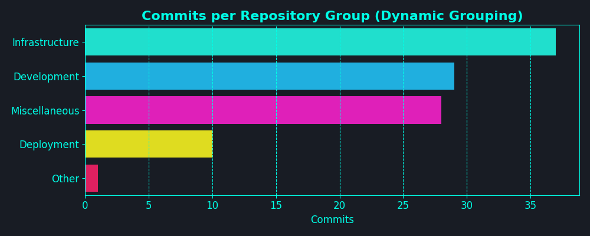
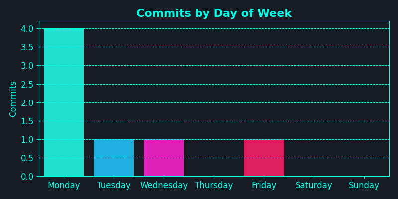
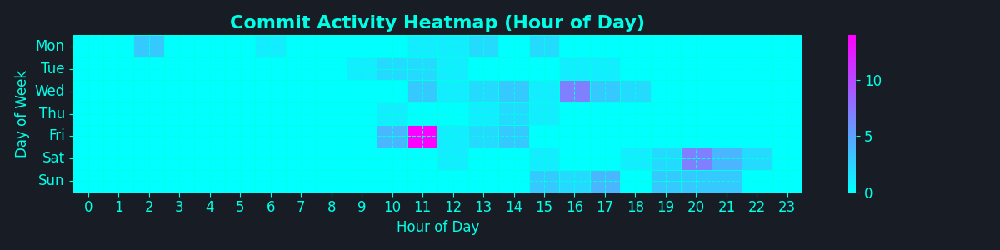
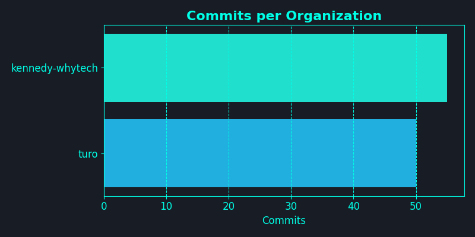
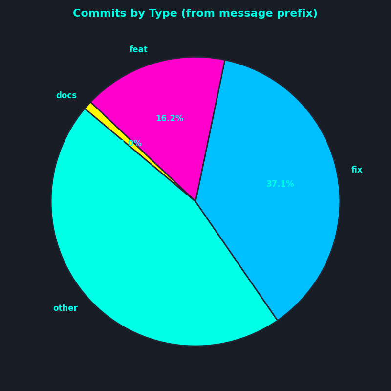
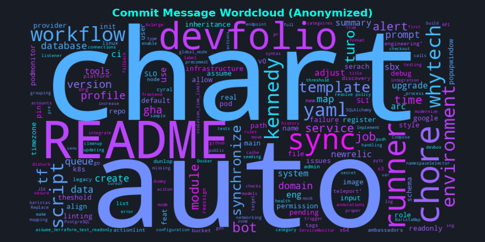

👋 Welcome to my DevFolio! I'm a Lazy Dev who find it hard to constantly mention about my dev in private repos, so I'm using AI to update it periodically via GHA. If anyone find this useful, please give me a star on [GitHub](https://github.com/kennedy-whytech/kennedy-whytech). I will try to make it open source soon.

## My Dev Activity [Interpreted by AI] for the last 30 days - Disclaimer: it can be really hilarious

- CI/CD & Automation: Introduced default-linux-x64 to actionlint 🤖
- Monitoring & Observability: Added alerts for pending jobs in arc runners 🚨
- Coding & Dev Productivity: Updated prompt format and categories input 🛠️
- Security & Access: Enhanced grouping security in prompts 🔒

## 📊 Visualizations

<table>
  <tr>
    <td></td>
    <td></td>
  </tr>
  <tr>
    <td></td>
    <td></td>
  </tr>
  <tr>
    <td></td>
    <td></td>
  </tr>
</table>

🚀 Thanks for reading! Connect with me on [LinkedIn](https://www.linkedin.com/in/kennedy-yau).
---
*Generated on 2025-07-02 17:08 EDT by DevFolio GitHub Action*  
*Analyzing commits from 2025-06-02 to 2025-07-02 (EDT)*
---
