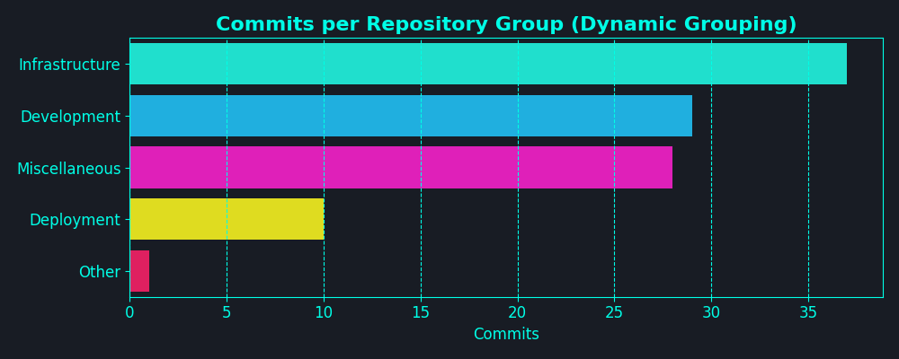
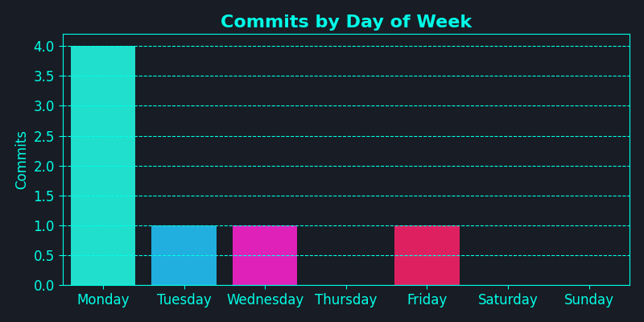
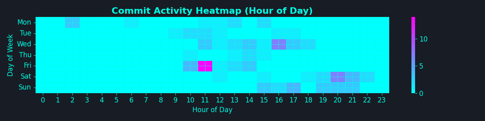
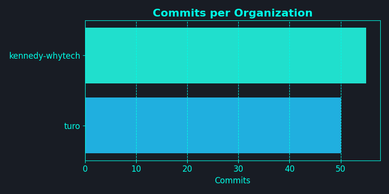
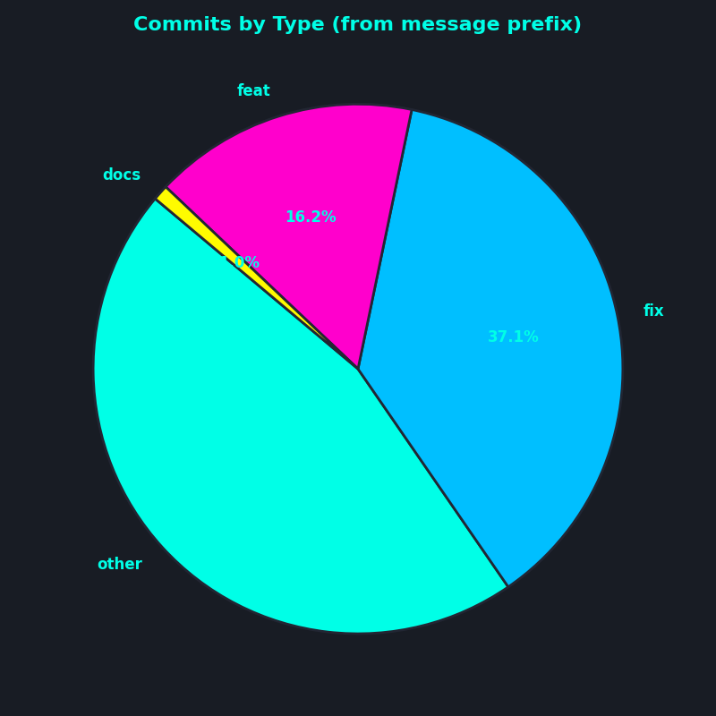
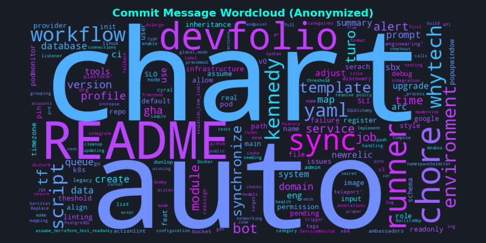

👋 Welcome to my DevFolio! I'm a Lazy Dev who find it hard to constantly mention about my dev in private repos, so I'm using AI to update it periodically via GHA. If anyone find this useful, please give me a star on [GitHub](https://github.com/kennedy-whytech/kennedy-whytech). I will try to make it open source soon.

## My Dev Activity [Interpreted by AI] for the last 30 days - Disclaimer: it can be really hilarious

- **Infrastructure & Platform:** Moved long term audit logs to cold storage and added expiration for transient data.
- **CI/CD & Automation:** Synchronized scripts from a domain infrastructure template repository.
- **Monitoring & Observability:** Enabled web-front-end-app to access a Storyblok bucket.
- **Coding & Dev Productivity:** Added the capability to assume an AWS role instead of using credentials for authentication.
- **Security & Access:** No specific activity inferred related to this category.

## 📊 Visualizations

<table>
  <tr>
    <td></td>
    <td></td>
  </tr>
  <tr>
    <td></td>
    <td></td>
  </tr>
  <tr>
    <td></td>
    <td></td>
  </tr>
</table>

🚀 Thanks for reading! Connect with me on [LinkedIn](https://www.linkedin.com/in/kennedy-yau).
---
*Generated on 2025-09-22 02:17 EDT by DevFolio GitHub Action*  
*Analyzing commits from 2025-08-23 to 2025-09-22 (EDT)*
---
