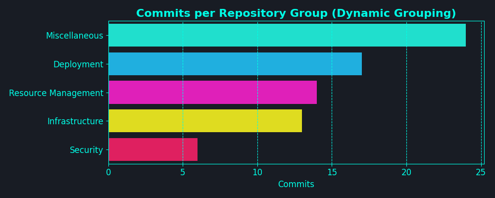

👋 Welcome to my DevFolio! I'm a Lazy Dev who find it hard to constantly mention about my dev in private repos, so I'm using AI to update it periodically via GHA. If anyone find this useful, please give me a star on [GitHub](https://github.com/kennedy-whytech/kennedy-whytech). I will try to make it open source soon.

## My Dev Activity [Interpreted by AI] - Disclaimer: it can be really hilarious

- Implemented secure grouping for prompts 🛡️
- Aligned timezone for charts input ⏰
- Updated prompt style and design ✨
- Added target-repo for updating other repositories 🚀
- Enhanced documentation for GitHub Actions 📚
- Leveraged virtual environment for development 🌐
- Triggered chart generation from the main branch 📈
- Updated secret naming conventions for better security 🔒

## 📊 Visualizations

<table>
  <tr>
    <td></td>
    <td></td>
  </tr>
  <tr>
    <td></td>
    <td></td>
  </tr>
  <tr>
    <td></td>
    <td></td>
  </tr>
</table>

🚀 Thanks for reading! Connect with me on [LinkedIn](https://www.linkedin.com/in/kennedy-yau).
---
*Generated on 2025-06-29 19:56 EDT by DevFolio GitHub Action*  
*Analyzing commits from 2025-05-30 to 2025-06-29 (EDT)*
---
