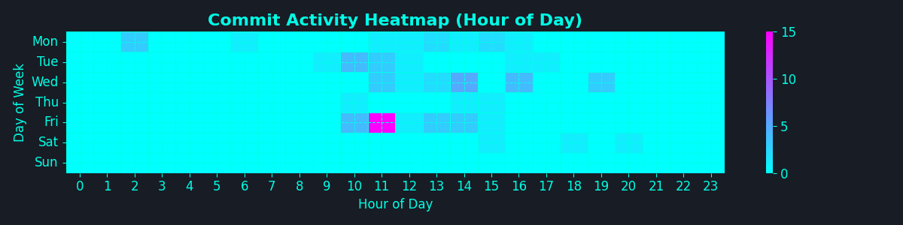

👋 Welcome to my DevFolio! I'm a Lazy Dev who find it hard to constantly mention about my dev in private repos, so I'm using AI to update it periodically via GHA. If anyone find this useful, please give me a star on [GitHub](https://github.com/kennedy-whytech/kennedy-whytech). I will try to make it open source soon.

## My Dev Activity [Interpreted by AI] - Disclaimer: it can be really hilarious

- **Deployment:** Upgraded tools, controllers, and listeners with enhanced features 🚀
- **Enhancements:** Fixed prompts and charts time zone issues, added new features to prompts and GitHub Actions
- **Infrastructure:** Updated environment tools and Kubernetes configurations
- **Automation:** Improved CI workflows, synchronized scripts, and added deployment automation
- **Testing:** Enhanced testing scenarios, added GPU node pool, and updated pod scheduling strategies

## 📊 Visualizations

<table>
  <tr>
    <td></td>
    <td></td>
  </tr>
  <tr>
    <td></td>
    <td></td>
  </tr>
  <tr>
    <td></td>
    <td></td>
  </tr>
</table>

🚀 Thanks for reading! Connect with me on [LinkedIn](https://www.linkedin.com/in/kennedy-yau).
---
*Generated on 2025-06-29 21:21 EDT by DevFolio GitHub Action*  
*Analyzing commits from 2025-05-30 to 2025-06-29 (EDT)*
---
