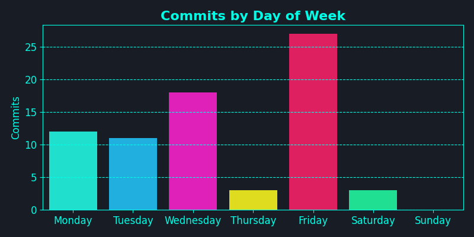
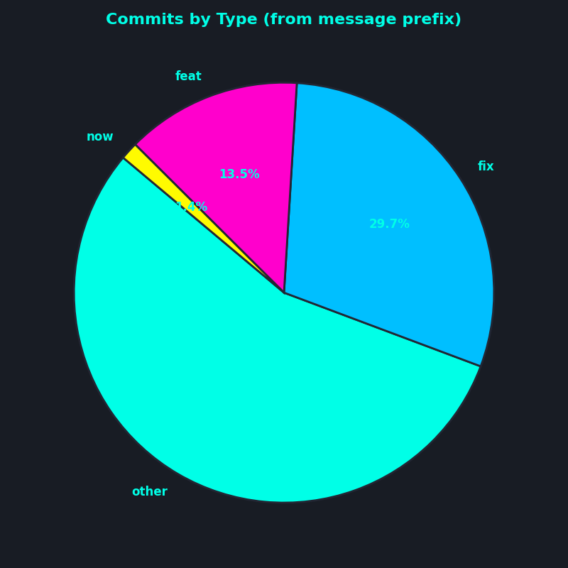

## My Dev Activity [Interpreted by AI] - Disclaimer: it can be really hilarious

- Implemented a stylish update to prompt style 🎨
- Enhanced GitHub Actions by adding target-repo capabilities 🚀
- Fixed issues like missing charts and permissions in the main codebase 🔧
- Streamlined documentation updates for GitHub Actions workflows 📚
- Introduced a new feature using virtual environments for improved development efficiency 💻
- Triggered chart generation from the main branch for seamless integration 📈
- Enabled full commit history to enhance version control visibility 🌟
- Automated PR approvals and merges for efficiency and collaboration 🤖

## 📊 Visualizations

---
*Generated on 2025-06-29 16:23 EDT by DevFolio GitHub Action*  
*Analyzing commits from 2025-05-30 to 2025-06-29 (EDT)*
---
