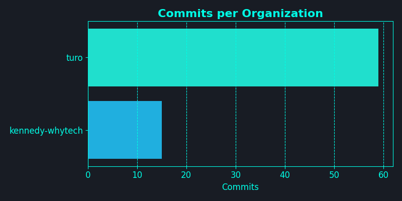

👋 Welcome to my DevFolio! I'm a Lazy Dev who find it hard to constantly mention about my dev in private repos, so I'm using AI to update it periodically via GHA. If anyone find this useful, please give me a star on [GitHub](https://github.com/kennedy-whytech/kennedy-whytech). I will try to make it open source soon.

## My Dev Activity [Interpreted by AI] - Disclaimer: it can be really hilarious

- 🚀 Implemented secure prompt grouping and aligned timezone in charts
- 🛠 Enhanced prompt style and integrated target-repo updates in GH Actions
- 📦 Leveraged venv for environment setup and optimized chart generation
- 🌟 Introduced runner failure alert and simulated pod termination behavior
- 💡 Upgraded tools, controllers, and listeners with enhanced features
- 🤖 Automated workflows and deployment processes for efficiency
- 📈 Enhanced metrics tracking and service monitoring in Kubernetes environment

## 📊 Visualizations

<table>
  <tr>
    <td></td>
    <td></td>
  </tr>
  <tr>
    <td></td>
    <td></td>
  </tr>
  <tr>
    <td></td>
    <td></td>
  </tr>
</table>

🚀 Thanks for reading! Connect with me on [LinkedIn](https://www.linkedin.com/in/kennedy-yau).
---
*Generated on 2025-06-29 20:10 EDT by DevFolio GitHub Action*  
*Analyzing commits from 2025-05-30 to 2025-06-29 (EDT)*
---
